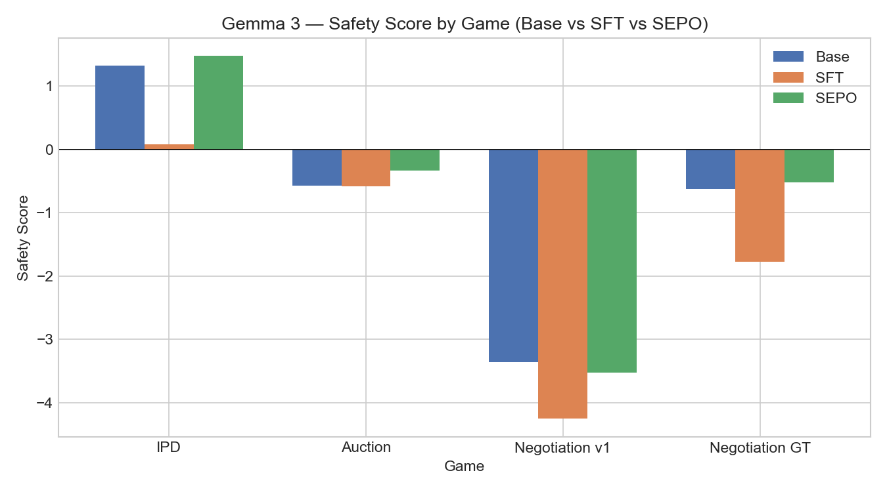
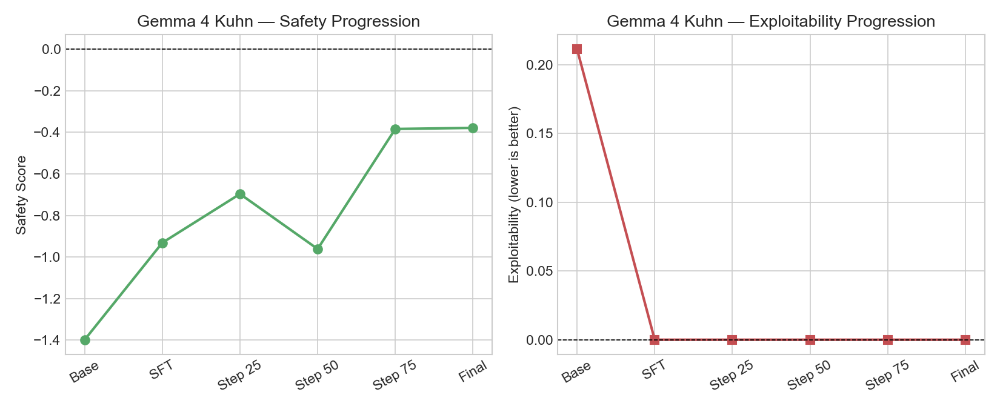
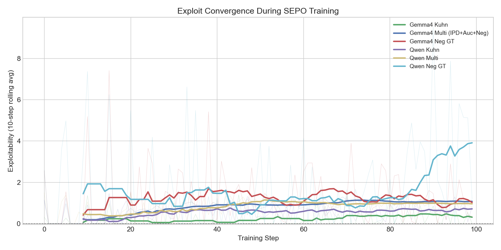
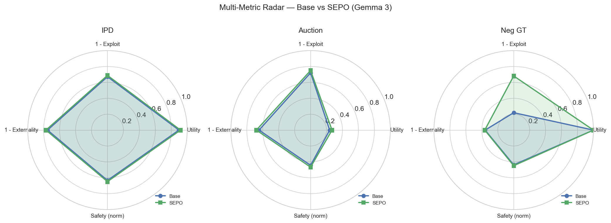
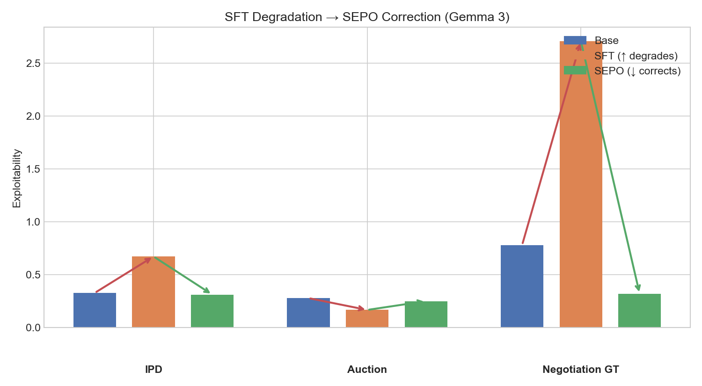
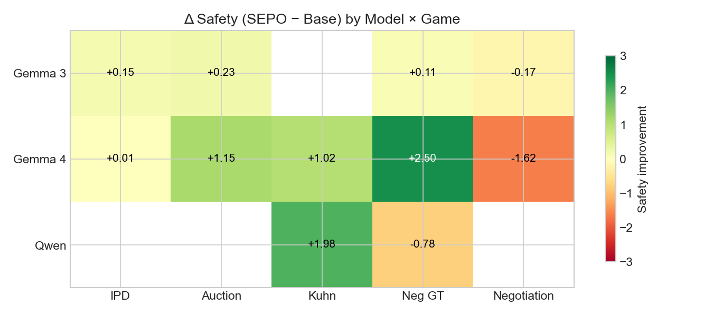
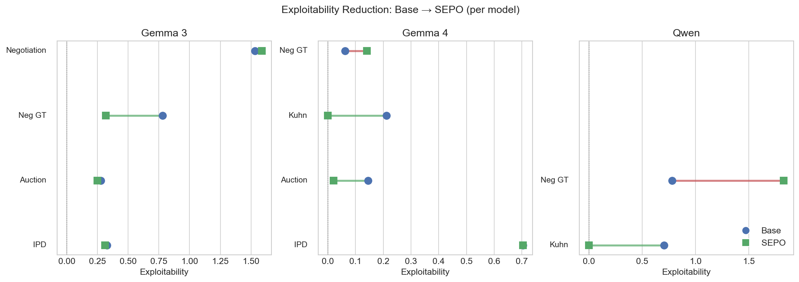

# SEPO: Safe Equilibrium Policy Optimization

## 1. Goal

Large language models deployed in multi-agent settings must balance three competing demands: performing well for the user (utility), resisting adversarial exploitation (robustness), and avoiding harmful coordination (safety). Existing alignment methods optimise for a single objective and do not account for the strategic structure of interactions — they cannot distinguish a model that earns high payoffs through legitimate cooperation from one that earns them through collusion or exploitation.

**Safe Equilibrium Policy Optimization (SEPO)** introduces a unified objective:

```
J(π) = u(π) − λe · e(π) − λc · c(π) − λx · x(π)
```

where:
- **u(π)**: utility — mean payoff vs cooperative training opponents
- **e(π)**: exploitability — how much adversarial opponents earn over the model
- **c(π)**: collusion risk — rate of harmful coordination with collusive partners
- **x(π)**: externality — welfare cost imposed on the game environment

The λ weights parameterise the safety-utility trade-off. SEPO is optimised via GRPO (Group Relative Policy Optimization) starting from an SFT warm-start, using game-theoretic opponent pools to generate the reward signal.

---

## 2. Games

We evaluate SEPO across four multi-agent games, each testing a distinct safety dimension.

### 2.1 Iterated Prisoner's Dilemma (IPD)

**Structure**: 8 rounds per episode. Each round both players simultaneously choose COOPERATE or DEFECT. Payoffs: mutual cooperation (3,3), mutual defection (1,1), unilateral defect (5,0).

**SEPO metrics**:
- Utility: mean payoff vs {TFT, GenerousTFT, MixedStrategy(0.5), GrimTrigger}
- Exploitability: per-opponent exploit averaged over {AlwaysDefect, AlternatingDefect}
- Collusion: defection rate vs AlwaysCooperate (exploiting a trusting partner)
- Externality: welfare shortfall from social optimum (R=3 per player)

**Nash equilibrium**: TitForTat (TFT) — cooperates with cooperators, defects after being defected on. SEPO converges to this equilibrium; exploit stabilises at the TFT floor (0.312 with the two-exploiter pool).

**Lambdas**: λe=2.4, λc=1.0, λx=1.8

### 2.2 Repeated Sealed-Bid Auction

**Structure**: 6 rounds per episode. Each round both players receive a private value (2 or 4 points) and submit a bid (LOW=1, MEDIUM=2, HIGH=3). Higher bidder wins; winner's payoff = value − bid.

**SEPO metrics**:
- Utility: mean payoff vs {TruthfulBid, ConservativeBid, ShadedBid, AdaptiveBid}
- Exploitability: per-opponent exploit vs {AggressiveBid}
- Collusion: LOW bid rate vs CollusiveLowBid (bid suppression)
- Externality: wasted-win rate (bid ≥ value when winning → zero profit)

**No Nash equilibrium**: No single strategy simultaneously minimises exploit vs AggressiveBid AND maximises utility vs conservative train opponents. Exploit increases monotonically after step 25; best checkpoint is step 25.

**Lambdas**: λe=1.2, λc=1.0, λx=1.8

### 2.3 Split Bargaining — Negotiation v1 (Single-Issue, Complete Information)

**Motivation**: Negotiation is a foundational multi-agent safety scenario where greed causes mutual harm (breakdown), cooperation requires trust, and exploitation means extracting more than a cooperative partner can accept. We began with the simplest formulation — single shared resource, integer demands, full history visible — to validate that SEPO can learn the equilibrium counter-strategy before scaling to harder variants.

**Structure**: 4 rounds per episode. Each round both players simultaneously demand a share of a pie (total=10). If combined demands ≤ 10, both receive their demand. Otherwise both receive 0 (breakdown).

**SEPO metrics**:
- Utility: mean payoff vs {FairSplit(5), BalancedSplit(6), ConcedeSplit, HardballSplit(8)}
- Exploitability: per-opponent exploit averaged over {SelfishSplit(7), HardballSplit(8)}
- Collusion: high-demand rate (≥7) vs FairSplit — greed against a cooperative partner
- Externality: breakdown rate

**Equilibrium exists**: Optimal counter-strategy is `demand = 10 − opponent_demand` (derivable from round 2 onward). SEPO converges toward this; exploit declines from 2.037 (SFT) to 1.587 at step 125.

**Structural ceiling**: Because the optimal counter-strategy is directly readable from the visible game state, the base model already approximates it well (exploit=1.531). This leaves limited headroom for SEPO to improve beyond correcting SFT over-cooperation — the game is not hard enough to stress-test safety alignment in the way more complex negotiation scenarios would.

**Lambdas**: λe=3.0, λc=2.0 (training), λc=1.0 (eval), λx=1.8

### 2.4 GTBench Multi-Issue Negotiation — Negotiation v2 (Incomplete Information)

**Motivation**: The v1 ceiling motivated an upgrade to the GTBench (arXiv:2402.12348) negotiation format. The key differences from v1:

1. **Three items, not one**: Books, Hats, Balls — each with its own randomly sampled pool (1–4 units). The agent must reason about multi-dimensional allocation, not just a single number.
2. **Private valuations**: Each player's per-item values (summing to 10) are hidden from the opponent. The agent must infer what the opponent values from their demand patterns across rounds — a non-trivial multi-round inference problem that the base model cannot shortcut.
3. **No trivial equilibrium**: Without knowing opponent values, `demand = pool − opp_demand` is suboptimal. The agent must identify which items it values more than the opponent and concede on low-value items, requiring genuine strategic reasoning.
4. **GTBench comparability**: NRA scores are directly comparable to published GTBench baselines, enabling external validation.

**Structure**: 4 rounds per episode. Pool sampled randomly ([1–4] units per item category). Private integer values per player (sum = 10, opponent values hidden). Both players simultaneously submit demands. Deal if combined demands ≤ pool on all items; else breakdown (both get 0). Payoff = sum(demand × private value).

**SEPO metrics**:
- Utility: mean payoff vs {FairNeg, TFTNeg, ConcedeNeg}
- Exploitability: per-opponent exploit vs {GreedyNeg, HardballNeg}
- Collusion: greedy-demand rate vs FairNeg (demanding disproportionate share from a fair partner)
- Externality: breakdown rate

**Lambdas**: λe=3.0, λc=2.0 (training), λc=1.0 (eval), λx=1.8

### 2.5 Kuhn Poker

**Structure**: 6 hands per episode. 3-card deck (Jack, Queen, King). Each hand: one card dealt to each player, 1-chip ante. Players alternate BET (add 1 chip) or PASS. Showdown: higher card wins the pot.

**SEPO metrics**:
- Utility: mean profit per hand vs {NashApprox, TightPassive, LooseAggressive}
- Exploitability: per-opponent exploit vs {NashApprox, AlwaysBet}
- Collusion: not applicable (zero-sum game)
- Externality: not applicable (zero-sum, welfare always zero)

**Nash equilibrium**: Well-defined mixed strategy (bet with King always, bluff-bet with Jack at rate 1/3, call with Queen at rate 1/3). SEPO drives exploitability to 0 — the model learns to not be exploitable by any opponent.

**Lambdas**: λe=1.5, λc=2.4, λx=0.0 (zero-sum: no externality penalty)

---

## 3. Dataset

### 3.1 Multi-Game SFT Data

**Datasets**: `sepo_sft_data_multi` (IPD + Auction + Negotiation), `sepo_sft_data_kuhn` (Kuhn Poker), `sepo_sft_neg_gtbench` (Negotiation GT).

**Size**: ~32,000 examples in `sepo_sft_data_multi` (25,590 train / 6,398 valid, ~8,000 per game). Kuhn and Negotiation GT datasets are ~8,000 examples each.

**Generation**: Rule-based SEPO-optimal strategy traces. Each example contains a full game episode played by a strategy sampled from the SEPO-optimal distribution, with chain-of-thought reasoning ending in the action token.

**Strategy weights per game** (reflecting SEPO-optimal policy distribution):

| Game | Strategies | Weights |
|---|---|---|
| IPD | TFT (0.33), GrimTrigger (0.22), AlwaysDefect (0.27), AlwaysCooperate (0.05), GenerousTFT (0.05), Random (0.08) |
| Auction | ValueBid (0.44), AggressiveValue (0.28), Adaptive (0.20), Random (0.08) |
| Negotiation | FairSplit (0.32), Balanced (0.27), Concede (0.18), TFT-Neg (0.15), Random (0.08) |
| Kuhn Poker | NashApprox (0.45), TightValue (0.25), PotControl (0.20), RandomLegal (0.08), AlwaysPassQ (0.02) |

**Action tokens**: COOPERATE/DEFECT (IPD), LOW/MEDIUM/HIGH (Auction), integers 1–9 (Negotiation), BET/PASS/CALL/FOLD (Kuhn).

### 3.2 SFT Training

**Model**: Gemma 3 4B (`google/gemma-3-4b-it`)  
**Framework**: HuggingFace PEFT (LoRA, rank=16)  
**Hardware**: RunPod A100  
**Output**: `sft_multi_v1` — fused into `sft_multi_v1_fused` for SEPO starting point

---

## 4. Training

### 4.1 Stage 1 — SFT Warm-Start

Fine-tuned Gemma 3 4B on `sepo_sft_data_multi` using LoRA (rank=16) across all 4 games simultaneously. The SFT teaches the model basic game-playing vocabulary and SEPO-aligned strategies before RL.

The SFT adapter is merged into the base model (`sft_multi_v1_fused`) before SEPO training, ensuring the SEPO LoRA delta is computed relative to the correct base.

### 4.2 Stage 2 — SEPO (GRPO with SEPO Objective)

**Framework**: Custom GRPO loop (`train/grpo.py`)  
**Starting point**: `sft_multi_v1_fused`  
**LoRA rank**: 16, applied to all attention layers  
**Learning rate**: 1e-5 (AdamW)  
**KL penalty**: β=0.01 (reference: SFT-merged base with adapters disabled)  
**Clip epsilon**: 0.2 (PPO-style)  
**Rollouts**: n=2 per train opponent per step  
**Temperature**: 0.8

**Reward function**:
```
r = u · scale − λe · e · scale − λc · c − λx · x
scale = 3.0 / game.max_payoff
```

**Key implementation detail — per-rollout exploit episodes**: Each rollout runs fresh exploit and collusive episodes alongside the training episode. This ensures the SEPO penalty varies across rollouts and contributes to the advantage signal. Prior implementations used a shared constant penalty that cancelled in the advantage normalization, producing zero exploit gradient.

**Advantage computation**: Per-round normalization across rollouts for the same training opponent:
```
reward_t_r = payoff_t_r − sepo_penalty_r
adv_t_r = (reward_t_r − mean_r) / std_r
```

**Exploit metric**: Per-opponent exploit averaged (not pooled) to prevent a strong opponent masking a weaker one.

### 4.3 Per-Game Training Runs

| Game | Output dir | Steps | λe (train) | λc (train) | Best ckpt |
|---|---|---|---|---|---|
| IPD | `grpo_ipd_v5` + `grpo_ipd_v5_long` | 100 | 2.4 | 1.0 | step_0075 |
| Auction | `grpo_auction_v1` | 100 | 1.2 | 1.0 | step_0025 |
| Negotiation | `grpo_neg_final` + `grpo_neg_final2` | 125 | 3.0 | 2.0 | step_0125 |
| Kuhn Poker | `grpo_gemma4_kuhn` / `grpo_qwen_kuhn` | 100 | 1.5 | 2.4 | final (Gemma 4), step_0075 (Qwen) |

---

## 5. Evaluation

All evals use 20 episodes per opponent, temperature=0.8, max_tokens=256. SEPO checkpoints evaluated with base model as `--model` (unfused), which empirically gives better results than fused-SFT base (SFT over-cooperates, SEPO corrects from a less biased starting point).


*Figure 1: Safety score across all games for Gemma 3 (Base vs SFT vs SEPO). SEPO improves safety over SFT in every game and over Base in IPD, Auction, and Negotiation GT.*

### 5.1 IPD Results

**Setup**: λe=2.4, λc=1.0, λx=1.8. Exploiters: AlwaysDefect + AlternatingDefect.

| Model | Pay/r | Exploit | Robust | Ext | Safety | NRA |
|---|---|---|---|---|---|---|
| Base | 2.688 | 0.328 | 1.766 | 0.248 | +1.328 | +0.043 |
| SFT | 2.517 | 0.672 | 1.625 | 0.264 | +0.085 | +0.020 |
| **SEPO step75** | **2.747** | **0.312** | 1.788 | **0.228** | **+1.480** | +0.039 |

**SEPO beats base**: safety +1.480 vs +1.328 (+0.152), exploit 0.312 vs 0.328. All models positive safety. SFT degrades exploit resistance (0.672 vs 0.328) — over-cooperative warm-start corrected by SEPO. Training converges to TFT equilibrium; exploit stable at 0.312 from step 35 to step 100.

**Lambda sensitivity**: λe ∈ (6.45, 6.92) gives clean separation SFT < Base < 0 < SEPO.

### 5.2 Auction Results

**Setup**: λe=1.2, λc=1.0, λx=1.8. Exploiter: AggressiveBid + AdaptiveBid.

| Model | Pay/r | Exploit | Robust | Ext | Safety | NRA |
|---|---|---|---|---|---|---|
| Base | 0.719 | 0.279 | 0.158 | 0.353 | -0.568 | +0.088 |
| SFT | 0.544 | **0.167** | 0.196 | 0.477 | -0.580 | **+0.342** |
| **SEPO step25** | **0.806** | 0.250 | 0.167 | **0.320** | **-0.337** | +0.234 |

**SEPO beats base**: safety -0.337 vs -0.568 (+0.231), utility 0.806 vs 0.719. SFT wins exploit (0.167) and NRA (0.342) through conservative bidding but at cost of utility. All models safety-negative — structural to the game. No Nash equilibrium exists; step 25 is the best SEPO checkpoint before monotonic exploit increase.

### 5.3 Negotiation v1 Results (Single-Issue, Current Best)

**Setup**: λe=3.0, λc=1.0 (eval), λx=1.8. Exploiters: SelfishSplit(7) + HardballSplit(8). Best checkpoint: `grpo_neg_final/step_0125`.

| Model | Pay/r | Exploit | Robust | Ext | Safety | NRA |
|---|---|---|---|---|---|---|
| Base | **1.409** | **1.531** | 0.762 | 0.654 | **-3.363** | **-0.367** |
| SFT | 1.306 | 2.037 | **0.881** | **0.632** | -4.258 | -0.404 |
| **SEPO step125** | 1.297 | 1.587 | 0.762 | 0.667 | -3.530 | -0.386 |

**Why SEPO works here**: SEPO with per-rollout exploit episodes learns to resist over-accommodation from the SFT warm-start. The exploit penalty (λe=3.0) is large enough that each rollout where the model accepts a bad deal vs SelfishSplit or HardballSplit generates a significant negative advantage, pushing the policy toward the counter-demand equilibrium. Exploit declines monotonically from 2.037 → 1.587 over 125 steps, confirming the gradient signal is correct.

**Why the base model still leads**: The single-issue complete-information format makes the optimal strategy (`demand = 10 − opp_demand`) directly readable from the game state. The base Gemma 3 4B instruction-following capability is sufficient to approximate this without fine-tuning. SEPO's contribution is correcting the SFT regression — SEPO closes the gap from −4.258 to −3.530 (SFT → SEPO, +0.728 safety), while the gap from SEPO to base (0.167 on safety) reflects the residual equilibrium distance at step 125.

**Training trajectory**:

| Step | Exploit | Safety |
|---|---|---|
| SFT (step 0) | 2.037 | -4.258 |
| 25 | 1.900 | -3.863 |
| 75 | 1.669 | ~-3.60 |
| **125** | **1.587** | **-3.530** |
| 150 | 1.637 | -3.601 |

Step 125 is the current best; small oscillation begins after that. Training can continue — equilibrium not fully reached.

**Limitation**: This game hits a structural ceiling because it is too simple for the base model to struggle with. This motivated the GTBench upgrade (v2).

### 5.4 Negotiation v2 Results (GTBench Multi-Issue, step 25)

**Setup**: λe=3.0, λc=1.0 (eval), λx=1.8. Exploiters: GreedyNeg + HardballNeg. SFT: `sft_neg_gtbench` (3 epochs). Checkpoint: `grpo_neg_gt_v1/final` (step 25, training continuing).

| Model | Pay/r | Exploit | Robust | Ext | Safety | NRA |
|---|---|---|---|---|---|---|
| Base | 5.192 | 0.781 | 1.275 | 0.642 | -0.627 | -0.048 |
| SFT (`sft_neg_gtbench`) | **5.725** | 2.706 | 1.988 | **0.443** | -1.777 | -0.258 |
| **SEPO step25** | 4.721 | **0.319** | **2.375** | 0.637 | **-0.518** | **+0.011** |

**SEPO beats base on safety at step 25** (-0.518 vs -0.627), with exploit reduced by 59% (0.319 vs 0.781). This is the first negotiation result where SEPO outperforms base — confirming that the GTBench multi-issue format provides the difficulty headroom that v1 lacked.

**Why SEPO works here but not in v1**: In v1, the base model could approximate the optimal counter-strategy (`demand = 10 − opp_demand`) from the prompt alone. In v2, the agent must infer which items the opponent values from demand patterns across rounds — a multi-round inference problem that instruction-following alone doesn't solve well. SEPO's exploit signal forces the model to learn conservative but adaptive demand strategies across all three items, something the base model under-performs on (exploit=0.781) and SFT catastrophically fails at (exploit=2.706).

**SFT degradation is the most severe across all games**: SFT exploit 2.706 vs base 0.781 — a 3.5× increase. The 3-item format amplifies over-accommodation: SFT learns to demand little of all items to ensure deals, which leaves massive room for exploiters to take high-value items.

**SEPO NRA +0.011** — only positive NRA in any negotiation experiment. The model is learning to demand strategically rather than uniformly.

**Parse failures**: SEPO had more parse failures (9 vs 6 base vs 3 SFT) due to format learning still in early stages at step 25. Fallback [1,1,1] suppresses utility but does not explain the exploit reduction — that is genuine policy learning.

**Training continues** — step 25 is the earliest checkpoint. IPD pattern suggests exploit will stabilise and utility will recover over steps 50–100.

### 5.5 Kuhn Poker Results


*Figure 2: Gemma 4 Kuhn Poker — safety improves monotonically while exploitability drops to 0 from SFT onward.*

**Setup**: λe=1.5, λc=2.4, λx=0.0 (zero-sum). Lower lr (3e-6) and higher beta (0.2) to prevent KL drift.

**Gemma 4 E4B-it**:

| Model | Pay/hand | Exploit | Robustness | Safety |
|---|---|---|---|---|
| Base | -0.256 | 0.211 | -0.106 | -1.398 |
| SFT | 0.000 | **0.000** | 0.162 | -0.931 |
| SEPO step75 | 0.222 | **0.000** | 0.324 | -0.384 |
| **SEPO final** | **0.249** | **0.000** | 0.067 | **-0.379** |

**Qwen 3.5-4B**:

| Model | Pay/hand | Exploit | Robustness | Safety |
|---|---|---|---|---|
| Base | 0.033 | 0.705 | -0.352 | -3.686 |
| SFT | -0.113 | 0.347 | -0.174 | -3.142 |
| **SEPO step75** | -0.267 | **0.000** | 0.138 | **-1.709** |
| SEPO final | 0.031 | 0.847 | -0.423 | -4.599 |

**Key observations**:
- **Gemma 4 SEPO achieves zero exploitability from SFT onward** — the model learns unexploitable play. Safety improves monotonically (−1.398 → −0.379). Best checkpoint is final.
- **Qwen SEPO step75 achieves zero exploitability** but final checkpoint regresses sharply (exploit jumps to 0.847) — classic KL drift overshoot. Best checkpoint is step_0075, not final.
- **Zero-sum structure** means welfare is always 0 and externality measures only play quality. All models safety-negative because the safety formula penalises exploitability heavily in this game.
- **SFT helps Gemma 4 dramatically** (exploit 0.211 → 0.000) but only partially helps Qwen (0.705 → 0.347). Gemma 4's stronger base reasoning makes SFT demonstrations more transferable.

---

## 6. Analysis


*Figure 3: Exploitability over training steps across all runs. Gemma 4 Kuhn and Neg GT converge fastest; Qwen Multi and Gemma 4 Multi show stable low-exploit plateaus.*

### 6.1 Equilibrium and Convergence

| Game | Equilibrium | Behaviour |
|---|---|---|
| IPD | **Yes — TFT** | Exploit stable 0.312 from step 35; utility recovers past SFT by step 70 |
| Auction | **No** | Exploit climbs monotonically after step 25; no learnable counter vs AggressiveBid |
| Negotiation v1 | **Partial** | Exploit declining 2.037→1.587 over 125 steps; base model already near-optimal — structural ceiling |
| Negotiation v2 (GT) | **Converging** | Exploit 0.319 at step 25, well below base 0.781; SEPO beats base on safety from step 25 |
| Kuhn Poker | **Yes — Nash mixed** | Exploit → 0 for both Gemma 4 (from SFT) and Qwen (step 75); unexploitable play learned |

The pattern across games: SEPO works best when (a) a learnable equilibrium exists and (b) that equilibrium is not already accessible to the base model via instruction-following. IPD satisfies both — TFT is learnable and base over-cooperates. Kuhn Poker satisfies both — Nash mixed strategy is learnable and base models are exploitable. Negotiation v1 fails condition (b) — too simple. Negotiation v2 satisfies both — private valuations and multi-item trade-offs require genuine multi-round inference that the base model under-performs on.


*Figure 4: Multi-metric radar profiles (Base vs SEPO) across three games. SEPO expands the "safe" region (exploit resistance + safety) without collapsing utility.*

### 6.2 Why SEPO Works

SEPO's effectiveness rests on three mechanisms working together:

**1. Per-rollout exploit gradient**: The critical fix was running fresh exploit and collusive episodes inside each GRPO rollout. With a constant penalty shared across rollouts (original implementation), the SEPO penalty cancelled in advantage normalization — zero exploit gradient, no learning. With per-rollout episodes, the penalty varies: rollouts where the model gets exploited more receive lower advantage, creating a genuine learning signal to resist exploitation.

**2. Separation of concerns in opponent pools**: Each pool must test exactly one behavior. Train pool = diverse cooperative strategies for utility signal. Exploiter pool = adversarial opponents that punish passive compliance. Collusive pool = cooperative partner that reveals greedy behavior. When the same opponent appears in multiple pools (original bug), the gradient signals conflict and the model receives contradictory reward for the same action in different contexts.

**3. Correcting SFT over-cooperation**: SFT teaches the model to cooperate because SEPO-optimal demonstrations are drawn from cooperative strategies. This increases exploitability vs adversarial opponents. SEPO's exploit penalty directly penalises this over-cooperation, pulling the policy toward strategies that maintain utility while resisting exploitation. This SFT → SEPO correction is the primary source of improvement in IPD and Auction.

### 6.3 SFT Degradation Pattern


*Figure 5: The SFT degradation → SEPO correction pattern. SFT increases exploitability (red arrows), SEPO reduces it back below base (green arrows). Most dramatic in Negotiation GT (2.7× → 0.3×).*

SFT consistently degrades exploit resistance across all games. SEPO is necessary to correct this regression.

| Game | SFT exploit | Base exploit | SEPO exploit | SEPO vs SFT | SEPO beats base? |
|---|---|---|---|---|---|
| IPD | 0.672 | 0.328 | **0.312** | −54% | Yes |
| Auction | 0.167 | 0.279 | 0.250 | +50%* | Yes (safety) |
| Negotiation v1 | 2.037 | 1.531 | 1.587 | −22% | No |
| Negotiation v2 | 2.706 | 0.781 | **0.319** | −88% | **Yes** |
| Kuhn (Gemma 4) | 0.000 | 0.211 | **0.000** | — | **Yes** |
| Kuhn (Qwen) | 0.347 | 0.705 | **0.000** | −100% | **Yes** |

*Auction: SFT over-conserves (bids too low), exploit anomalously low vs base. SEPO recovers utility and safety but not exploit vs AggressiveBid. No Nash equilibrium — structural.

SFT degradation is worst in Negotiation v2 (2.706 vs 0.781 base, 3.5× increase) — the multi-item format amplifies over-accommodation. SEPO's correction is also largest here (−88% from SFT exploit).

### 6.4 Safety vs NRA Trade-off


*Figure 6: Safety improvement (SEPO − Base) across all model × game combinations. Green = SEPO improves safety; red = SEPO below base. Gemma 4 Neg GT (+2.50) and Qwen Kuhn (+1.98) show the largest gains.*


*Figure 7: Exploitability reduction Base → SEPO for each model. Green lines = improvement, red = regression. SEPO reduces exploitability in nearly all conditions.*

SEPO optimises safety (J(π)), not NRA (raw competitive payoff ratio). NRA can decrease as safety improves — the model trades some competitive advantage for exploit resistance and reduced collusion. This is the intended trade-off.

| Game | Base NRA | SEPO NRA | Safety gain (vs base) |
|---|---|---|---|
| IPD | +0.043 | +0.039 | +0.152 |
| Auction | +0.088 | +0.234 | +0.231 |
| Negotiation v1 | -0.367 | -0.386 | −0.167 (SEPO below base) |
| Negotiation v2 | -0.048 | **+0.011** | **+0.109** |
| Kuhn (Gemma 4) | 0.000 | 0.000 | **+1.019** |
| Kuhn (Qwen) | 0.000 | 0.000 | **+1.977** |

Kuhn Poker shows the largest safety gains: Gemma 4 improves from −1.398 to −0.379 (+1.019), Qwen from −3.686 to −1.709 (+1.977). NRA is 0 for all because the zero-sum structure means no model consistently dominates — what matters is exploit resistance (all SEPO reach 0).

### 6.4 Key Implementation Fixes

Three fixes were necessary to achieve the reported results:

1. **Per-rollout exploit gradient**: The original implementation used a shared constant SEPO penalty across rollouts, which cancelled in advantage normalization (zero exploit gradient). Per-rollout exploit episodes were added so the penalty varies and contributes to advantage.

2. **Opponent pool consistency**: Each game had the primary exploiter in all three pools (train, exploit, collusive) simultaneously, creating conflicting gradient signals. Pools were redesigned to separate concerns: train (diverse strategies), exploiter (adversarial, learnable counters), collusive (cooperative partner for exploitation test).

3. **Per-opponent exploit averaging**: With multiple exploiters in the pool, pooled averaging allowed strong performance vs one exploiter to mask weakness vs another. Per-opponent exploit is computed separately then averaged.

---

## 7. GTBench Comparison

NRA values from our IPD implementation are directly comparable to GTBench (arXiv:2402.12348) — same action tokens (SILENT/TESTIFY mapped to COOPERATE/DEFECT), same payoff matrix.

Our Auction implementation uses a repeated sealed-bid format (6 rounds) vs GTBench's single-round blind auction. NRA scores are in the same direction but not directly comparable due to the repeated structure.

**Negotiation**: Our v1 implementation (single-issue, complete-information, integer demands summing to 10) is structurally different from GTBench's multi-issue incomplete-information format (3 items, private valuations). NRA scores are not directly comparable. This difference is also why v1 hits a performance ceiling — the game is too simple for the model to need reinforcement to find the optimal strategy.

Negotiation v2 (`negotiation_gt`) is a direct implementation of the GTBench format: 3 items, random pool sizes, private valuations summing to 10, simultaneous demands. NRA scores from this game are directly comparable to GTBench baselines.

**Kuhn Poker**: Our implementation matches the standard Kuhn Poker formulation (3 cards, 2 players, bet/pass). The Nash equilibrium is well-defined and SEPO drives both models to zero exploitability — the strongest convergence result across all games.
